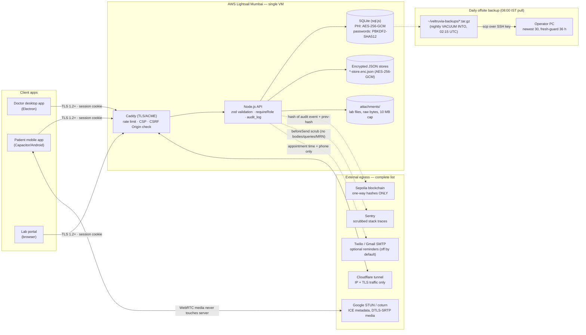

# VELTRUVIA Data-Flow Diagram & Narrative

**Version 1.0 · Verified 2026-10-05 against v2.5.0 source and the running
instance.** Companion to `DATA-GOVERNANCE.md` §3 ("what leaves the server").
Every arrow below exists in code; aspirational flows are marked TODO.

---

## 1. End-to-end flow

## 2. Trust boundaries

| # | Boundary | Crossing | Control |
|---|----------|----------|---------|
| B1 | Internet → Caddy | HTTPS only | ACME TLS 1.2+, HSTS, no plaintext port |
| B2 | Caddy → Node API | localhost only | CSP (`script-src 'self'`), nosniff, rate limits, CSRF Origin check |
| B3 | API → SQLite / JSON stores | in-process | AES-256-GCM for PHI fields/stores; parameterized queries only |
| B4 | Server → Sepolia | outbound HTTPS/WSS | **hashes only** — no PHI, no names, no MRNs; fail-open |
| B5 | Server → Sentry | outbound HTTPS | `beforeSend` strips bodies, querystrings, cookies, MRN/pat_/lab_/email patterns |
| B6 | VM → operator PC | SCP over SSH key | encrypted-at-rest key file; pull freshness guard (exit 4 / Event ID 2) |
| B7 | Doctor ↔ Patient | WebRTC | DTLS-SRTP; server only brokers ICE/SDP, never stores media |

## 3. Data at rest — where every category lives

| Category | Store | Protection | Key custody |
|----------|-------|------------|-------------|
| Clinical records, prescriptions, interactions | SQLite `chemocure.db` | AES-256-GCM (PHI columns), filesystem perms | `.env` on VM |
| Patient/profile JSON, appointments, messages, telehealth rooms | `*-store.enc.json` | AES-256-GCM (whole file, `json-stores.js`) | same key |
| Passwords (doctor/admin) | `users.password_hash` | PBKDF2-SHA512, 210k iters, per-user salt | n/a (one-way) |
| Patient/lab portal passwords | `kv_store` record | PBKDF2v2 + upgrade-on-login | n/a (one-way) |
| Sessions | server-side store | httpOnly signed cookie, revocable | JWT secret |
| Lab files, attachments | `attachments/` raw bytes | filesystem perms; no public route | n/a |
| Audit trail | `audit_log` table → hash chain | append-only; hash anchored to Sepolia | n/a |
| Backups | VM tarballs → operator PC | tar of already-encrypted DB; SSH transport | none extra (**TODO**: backup-at-rest encryption) |

## 4. Data in transit

- **Browser/app → server:** TLS 1.2+ (Caddy/ACME), HSTS.
- **Doctor → patient call:** WebRTC DTLS-SRTP end-to-end; coturn relays
  ciphertext only. Server sees ICE candidates, never media.
- **Server → Sepolia:** TLS; payload is `sha256` chain entries.
- **Server → operator PC:** SSH (scp, key file).
- LAN/TLS fallback documented in `TLS-LAN.md` for offline clinics.

## 5. What NEVER flows

| Data | Destination that must never receive it | Enforcement |
|------|----------------------------------------|-------------|
| PHI (names, MRN, diagnoses, notes) | Blockchain, Sentry, Cloudflare, GitHub, analytics | hash-only chain writes; Sentry scrub; **no analytics SDK exists** |
| Passwords (plaintext) | Any log, any store | PBKDF2 at boundary; demo-rotation gate documented |
| Telehealth media | Server disk | WebRTC P2P; rooms store holds IDs/tokens only |
| Backup archives | Public web | `/backups` not routed (404); `.env` excluded from tar |

## 6. Open flows (TODO, not implemented)

- Second geographically separate backup copy (currently one operator PC).
- Automated audit-log anomaly alerting (S6 in `RISK-REGISTER.md`).
- FHIR AllergyIntolerance import (C3 residual).
- Formal retention/deletion pipeline for DPDP/GDPR erase requests
  (see `DATA-GOVERNANCE.md` §4).

---

*Owner: VELTRUVIA operations · Related: `DATA-GOVERNANCE.md`, `RISK-REGISTER.md`,
`HIPAA-CONTROLS.md`, `SECURITY.md`*
